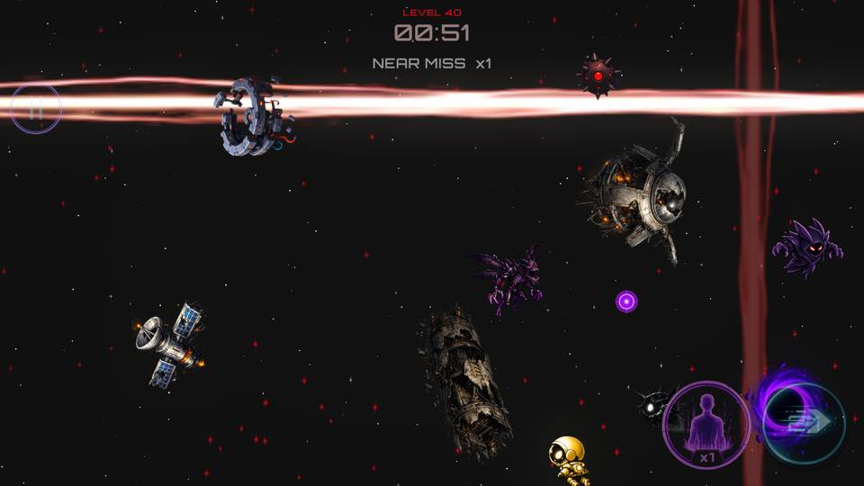
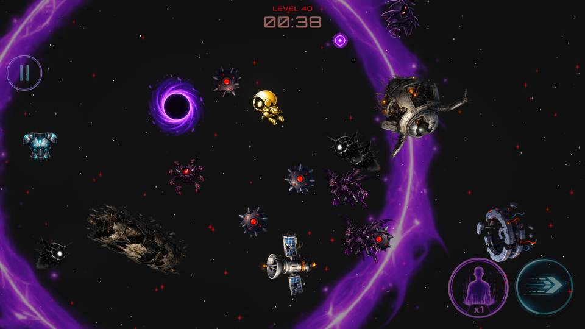
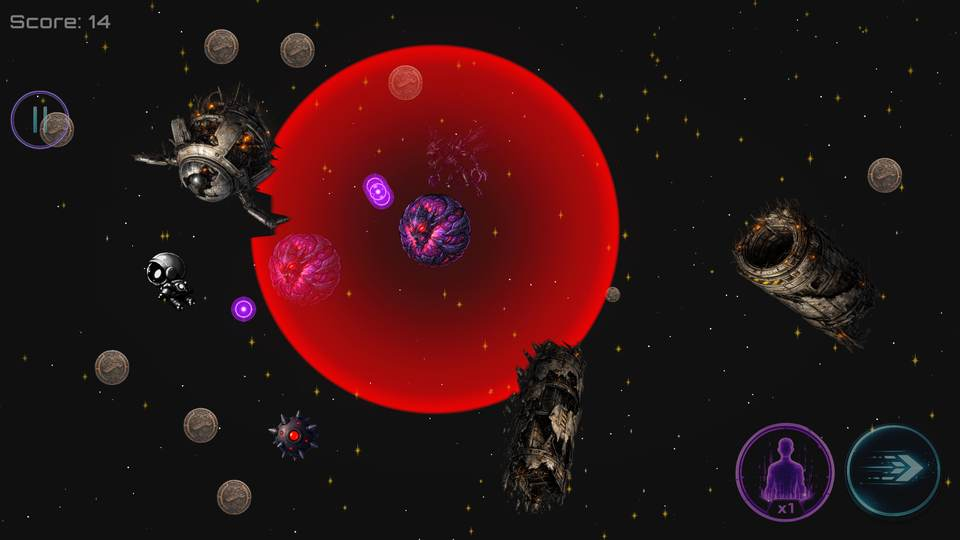

# Fateful Rush

**Fateful Rush** is a fast-paced 2D arcade survival game developed by **YoungDev Studios**. Movement, timing and risk decide everything as players dodge cosmic hazards, build combos and fight through 40 progressively challenging missions.

## Play Now

**Fateful Rush is officially available on Google Play.**

[Download Fateful Rush on Google Play](https://play.google.com/store/apps/details?id=com.youngdevstudios.fatefulrush)

---

## Screenshots

  
  

  

---

## Features

- **40 progressively challenging missions** with multiple objective types
- Fast and responsive **2D arcade survival gameplay**
- **Dash, Clone and Slow** abilities
- **Combo** and **Near Miss** risk/reward systems
- Multiple enemy types including **Stalkers, Blasters, Hunters and Beacons**
- Cosmic hazards including **lasers, black holes and space bombs**
- Multi-stage **Boss and Mini-Boss encounters**
- Unlockable player **skins and cosmetic progression**
- Persistent player **statistics and best times**
- **Google Play Games achievements**
- Mobile-focused controls, audiovisual feedback and haptics

---

## Gameplay

Players enter increasingly hostile arenas and complete one of several mission objectives:

- Reach a target score
- Survive for a required amount of time
- Reach the required score before time runs out

Coins, power-ups, abilities and enemy behaviour create a risk/reward loop where aggressive movement can produce higher combos and Near Miss streaks, while a single mistake can end the run.

New mechanics are introduced gradually across the campaign before being combined into more demanding late-game missions.

---

## Technical Highlights

Fateful Rush was built as both a complete mobile game and a Unity development portfolio project. The project includes:

- Data-driven mission configuration with **ScriptableObjects**
- Modular enemy behaviours and shared balance systems
- Runtime **object and projectile pooling**
- Predictive enemy movement and obstacle avoidance
- Persistent progression, settings and statistics
- Reusable UI animation and feedback systems
- Custom mobile control layout
- Audio Mixer-based sound routing
- **Unity Adaptive Performance** integration
- Thermal/performance-aware mobile optimization
- Google Play Games Services integration

---

## Technology Stack

- **Unity 6**
- **C#**
- **Universal Render Pipeline (URP)**
- **Unity Input System**
- **Unity Adaptive Performance**
- **Google Play Games Services**
- **Git / GitHub**

---

## Platforms

### Android

This repository contains the **Android version** of Fateful Rush.

- Platform: Android
- Distribution: Google Play
- Mobile touch controls
- Haptic feedback
- Unity Adaptive Performance integration

[Download Fateful Rush on Google Play](https://play.google.com/store/apps/details?id=com.youngdevstudios.fatefulrush)

### Windows

A separate PC version is maintained for **Google Play Games on PC**.

[View the Fateful Rush PC Repository](https://github.com/ardagencdev/Fateful-Rush-PC)

The PC project shares the core gameplay systems with the Android version while maintaining separate platform-specific controls, UI behaviour, performance settings and configuration.

---

## Release Status

**Released.** Fateful Rush is publicly available on Google Play.

The project will continue to receive fixes, balancing improvements and post-release updates where needed.

### v1.0 — Initial Release

- 40-mission campaign
- Full enemy and hazard roster
- Boss encounters
- Ability and power-up systems
- Combo and Near Miss mechanics
- Unlockable skins
- Persistent statistics
- Google Play Games achievements

---

## Developer

Developed and published by **YoungDev Studios**.

This repository contains the Android version of Fateful Rush and documents the systems built for its production release.

The Windows version is maintained separately in the [Fateful Rush PC repository](https://github.com/ardagencdev/Fateful-Rush-PC).
